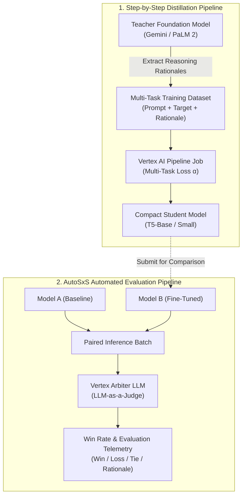

<div align="center">

# Vertex LLM Distillation & AutoSxS Evaluation Suite

[](https://cloud.google.com/vertex-ai)
[-007D9C?style=flat)](https://www.kubeflow.org)
[](https://python.org)
[](LICENSE)

An enterprise-grade production framework for **Step-by-Step Foundation Model Distillation** and **Automated Side-by-Side (AutoSxS) Model Evaluation** on Google Cloud Vertex AI Managed Pipelines.


</div>

---

## ⚡ Overview

Deploying frontier large language models (LLMs) into production requires balancing performance, latency, and operational inference costs. This repository provides an end-to-end MLOps toolkit integrating two critical enterprise capabilities:

1. **Step-by-Step Model Distillation (`DistillationStepbyStep`):** Extracts intermediate reasoning rationales from frontier teacher models (e.g. PaLM 2 / Gemini) to train lightweight, high-speed student architectures (e.g. T5-small/base/large) via multi-task loss ($\mathcal{L} = \alpha \mathcal{L}_{task} + (1-\alpha) \mathcal{L}_{rationale}$), shrinking model footprints by up to 10x while preserving task accuracy.
2. **AutoSxS LLM-as-a-Judge Evaluation:** Orchestrates managed Kubeflow pipelines that pit candidate models (e.g. Fine-tuned model vs. Baseline foundation model) against each other with an automated Arbiter judge. Generates win rates, tie frequencies, and human-interpretable justification rationales.

---

## 🏗️ Architecture & Workflow



---

## 📊 Distillation Step-by-Step vs Standard Fine-Tuning

| Metric / Dimension | Standard Fine-Tuning | Distillation Step-by-Step | Impact |
| :--- | :---: | :---: | :--- |
| **Supervision Signal** | Label / Output only | Output + Chain-of-Thought Rationale | Richer gradient updates |
| **Training Data Needed** | High ($10^4 - 10^5$ samples) | Low ($10^2 - 10^3$ samples) | **~5-10x data reduction** |
| **Deployment Footprint** | Massive (7B - 70B parameters) | Compact (220M - 770M parameters) | **~10x lower inference latency** |
| **Serving Cost** | High GPU allocation (A100/H100) | Low-cost CPU or T4/L4 GPU | **~80% operational cost savings** |

---

## 📁 Repository Layout

```text
vertex-llm-distillation-eval/
├── assets/
│   └── banner.jpg                            # Project architecture banner & NanoBanana mascot
├── distillation/
│   └── pipeline_distillation.py              # Vertex AI Step-by-Step Distillation launcher
├── evaluation/
│   ├── pipeline_autosxs_eval.py              # AutoSxS side-by-side LLM-as-a-judge pipeline
│   └── pipeline_task_eval.py                 # Quantitative task evaluation pipeline (QA/Summ/Class)
├── notebooks/
│   ├── 01_distillation_step_by_step.ipynb    # Interactive distillation tutorial
│   ├── 02_autosxs_model_evaluation.ipynb     # AutoSxS experimental workflow & arbiter inspection
│   └── 03_vertex_llm_task_evaluation.ipynb   # Vertex managed task evaluation demo
├── data/
│   ├── distillation_sample_5.json            # Sample distillation data
│   └── distillation_sample_50.json           # 50-example benchmark sample
├── requirements.txt                          # Python dependencies
├── LICENSE                                   # Apache 2.0 License
└── README.md                                 # Technical documentation & guide
```

---

## 🚀 Quick Start

### 1. Installation & GCP Authentication

```bash
git clone https://github.com/analyticsrepo01/vertex-llm-distillation-eval.git
cd vertex-llm-distillation-eval

pip install -r requirements.txt
```

Authenticate your local environment with Google Cloud:
```bash
gcloud auth application-default login
gcloud config set project YOUR_PROJECT_ID
```

---

## 🛠️ Step-by-Step Distillation

Submit a Step-by-Step Distillation pipeline job to Vertex AI:

```bash
python distillation/pipeline_distillation.py \
    --project_id "YOUR_PROJECT_ID" \
    --location "us-central1" \
    --teacher_model "text-bison@002" \
    --student_model "t5-base" \
    --train_dataset_uri "gs://YOUR_GCS_BUCKET/data/train_data.jsonl" \
    --gcs_output_dir "gs://YOUR_GCS_BUCKET/distillation_output" \
    --train_steps 1000 \
    --alpha 0.5
```

> [!TIP]
> Use `--dry_run` to inspect and validate the pipeline specification JSON without submitting a live job to GCP:
> ```bash
> python distillation/pipeline_distillation.py --dry_run
> ```

---

## ⚖️ AutoSxS (Side-by-Side) Model Evaluation

Compare two candidate models (e.g. baseline vs fine-tuned) using an automated Arbiter LLM on Vertex AI:

```bash
python evaluation/pipeline_autosxs_eval.py \
    --project_id "YOUR_PROJECT_ID" \
    --location "us-central1" \
    --model_a "text-bison@002" \
    --model_b "projects/YOUR_PROJECT/locations/us-central1/endpoints/YOUR_ENDPOINT_ID" \
    --task_type "question-answering" \
    --judgement_model "gemini-1.5-pro" \
    --eval_dataset_uri "gs://YOUR_GCS_BUCKET/data/eval_prompts.jsonl" \
    --gcs_output_dir "gs://YOUR_GCS_BUCKET/autosxs_output"
```

### AutoSxS Evaluation Telemetry Output:
The pipeline produces structured statistical metrics including:
* **Win Rate (Model B vs Model A):** Percentage of prompts where the candidate outperformed baseline.
* **Tie Rate:** Percentage of equivalent generations.
* **Arbiter Rationale Breakdown:** Explanatory text analyzing why a specific completion was preferred (factual accuracy, groundedness, completeness).

---

## 📈 Quantitative Task Evaluation

Run task-specific automated evaluations (Exact Match, F1, ROUGE, BLEU, or Confusion Matrix):

```bash
python evaluation/pipeline_task_eval.py \
    --project_id "YOUR_PROJECT_ID" \
    --location "us-central1" \
    --task_type "summarization" \
    --model_name "text-bison@001" \
    --dataset_uri "gs://YOUR_GCS_BUCKET/data/summarization_eval.jsonl" \
    --gcs_output_dir "gs://YOUR_GCS_BUCKET/eval_output"
```

Supported evaluation tasks:
* `question-answering`: Exact Match, F1, BLEU, ROUGE-1/2/L
* `summarization`: ROUGE-1, ROUGE-2, ROUGE-L
* `text-generation`: Perplexity, BLEU, ROUGE
* `classification`: Accuracy, Precision, Recall, Confusion Matrix, Confidence Curves

---

## 📓 Interactive Notebooks

Detailed, reproducible Jupyter notebooks are provided in [`notebooks/`](notebooks/):
* [`01_distillation_step_by_step.ipynb`](notebooks/01_distillation_step_by_step.ipynb): End-to-end data preparation, teacher rationale extraction, and student deployment.
* [`02_autosxs_model_evaluation.ipynb`](notebooks/02_autosxs_model_evaluation.ipynb): Deep dive into AutoSxS arbiter configuration and pairwise win rate analysis.
* [`03_vertex_llm_task_evaluation.ipynb`](notebooks/03_vertex_llm_task_evaluation.ipynb): Quantitative metrics exploration and confusion matrix visualization.

---

## 📜 License

This project is licensed under the **Apache License 2.0** - see the [LICENSE](LICENSE) file for details.

---

## 👤 Author

* **Saurabh Mangal** ([`analyticsrepo01`](https://github.com/analyticsrepo01))
